# skratchでシューティングゲームを作ろう！

今からscratchというソフトを使って自分だけのゲームを作りましょう！

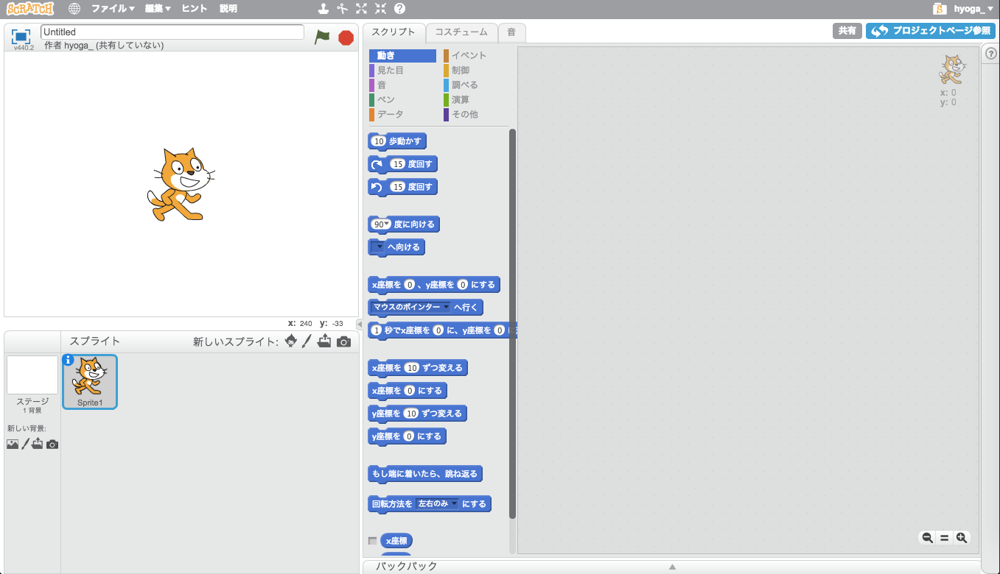

このような画面が見えますか？困ったことがあったらえんりょなく聞いてね！
ではゲームを作っていきましょう！

## 1.背景を設定する

今からゲームの背景を決めます！

ここをクリックして下さい。

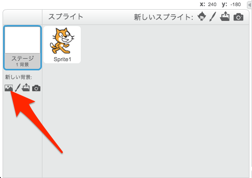

下のような画面がでましたか？

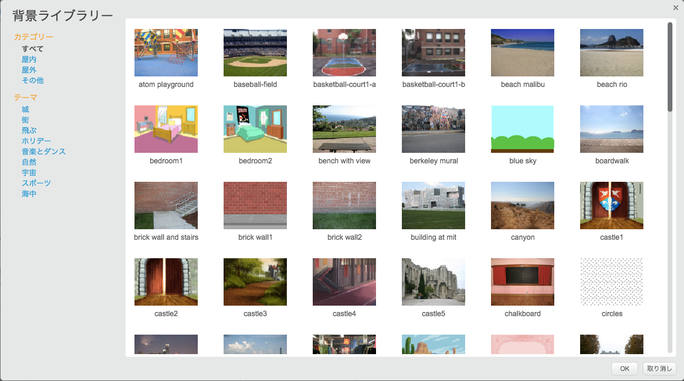

次に下にスクロールして行き、stars という背景をクリックしてみてください。

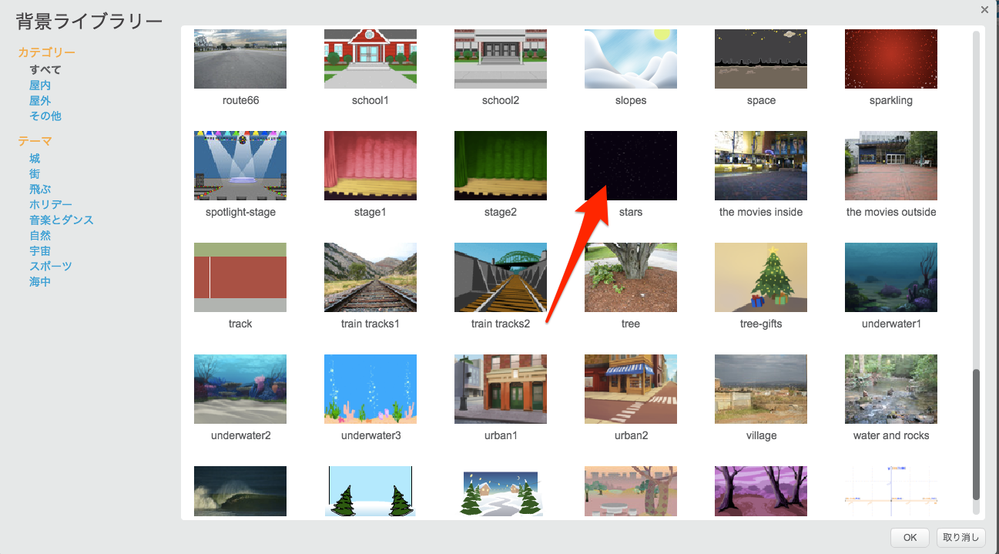

背景が変わって宇宙になってますね！

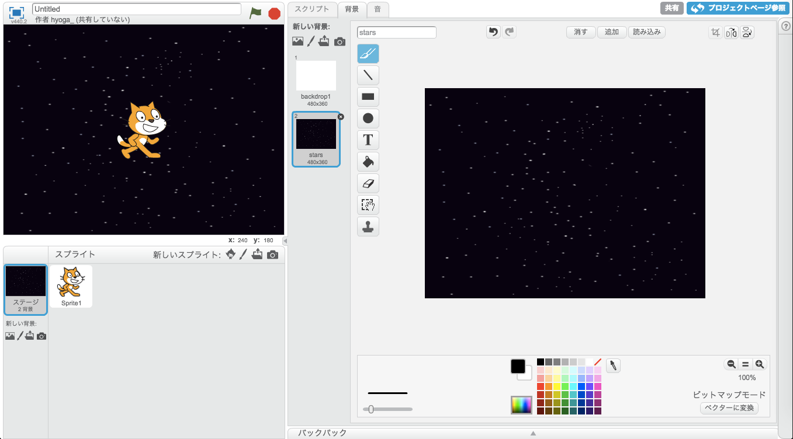

ここまでできれば背景の準備は終わりです！
次に行きましょう！

## 2.キャラクターを置く

次が自分がそうさするキャラクターを作りましょう！
ここをクリックしてください。

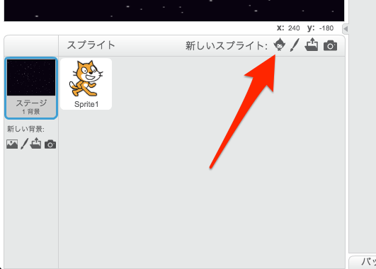

下のような画面が出ていますか？

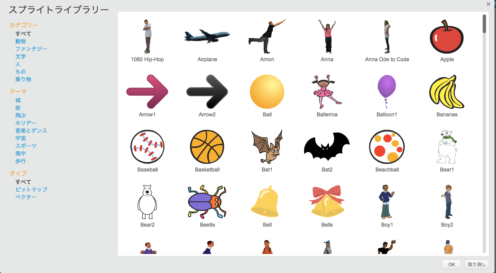

たくさんのキャラクターがいますが、今回は左の『乗り物』をクリックして、

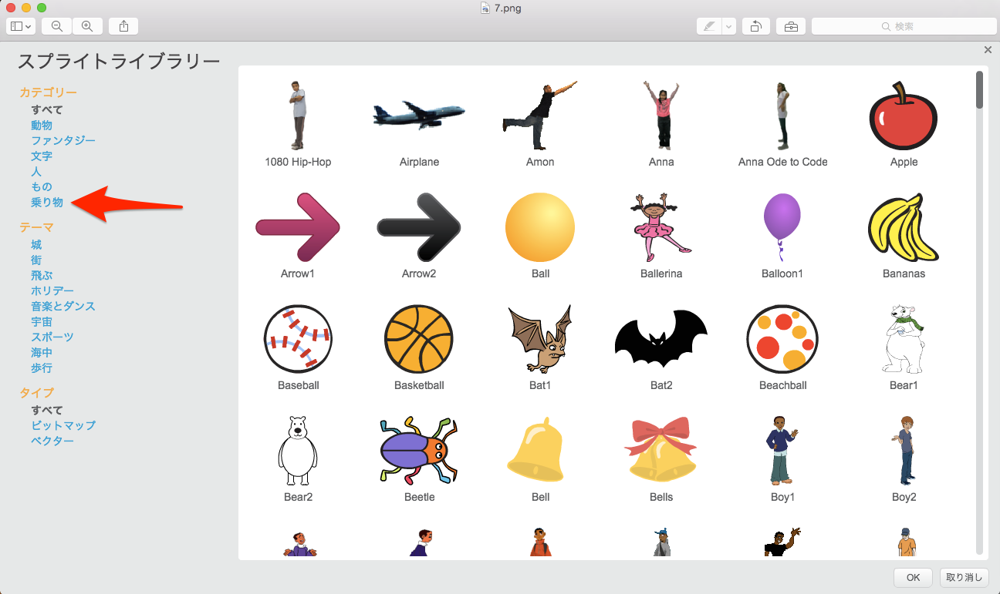

『spaceship』をクリックしましょう！

スペースシップが出てきました！
ですが、少し大きいですね、
少し小さくしましょう！

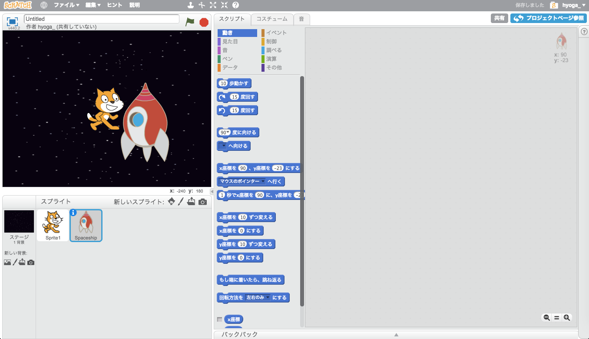

スペースシップをクリックして、コスチュームをクリックしましょう！

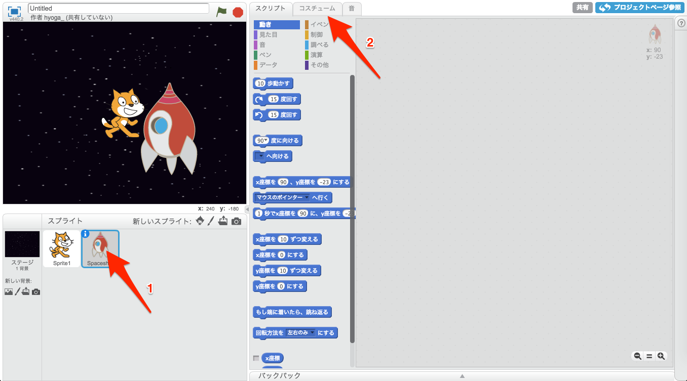

このような画面になりましたね？
次はスペースシップをクリックして、角の四角をドラッグしましょう！
クリックして、押したままスペースシップの大きさを変えて、
好きなサイズになったら指をはなせばOKです。

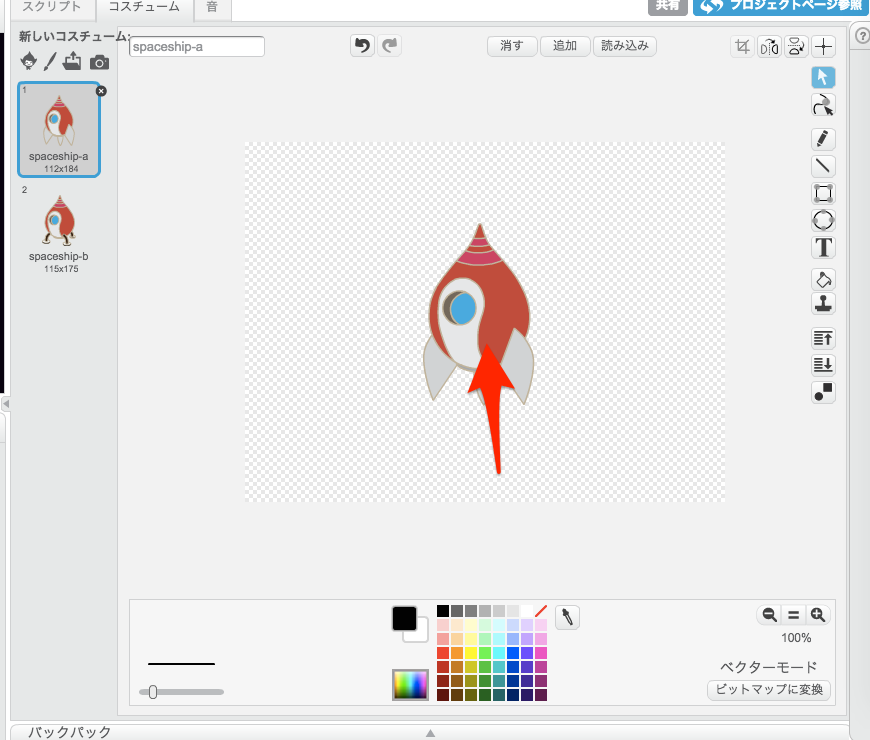

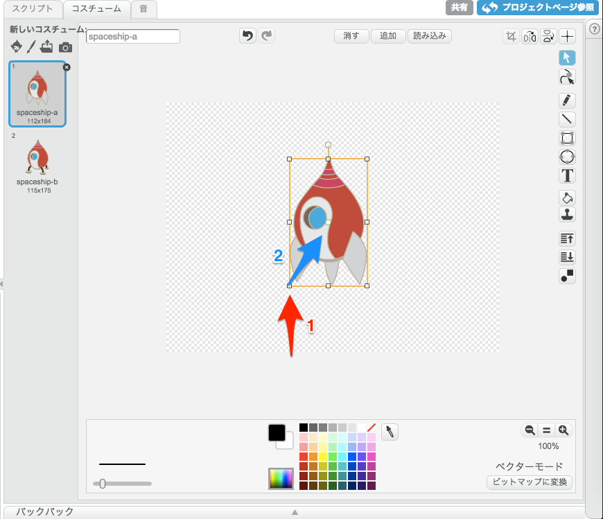

今回はスペースシップを横にして使うので、
スペースシップをクリックして、
上の丸をドラッグして横にしてください！

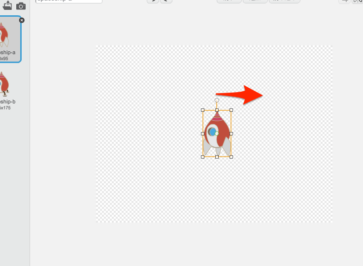

横向きになりましたか？

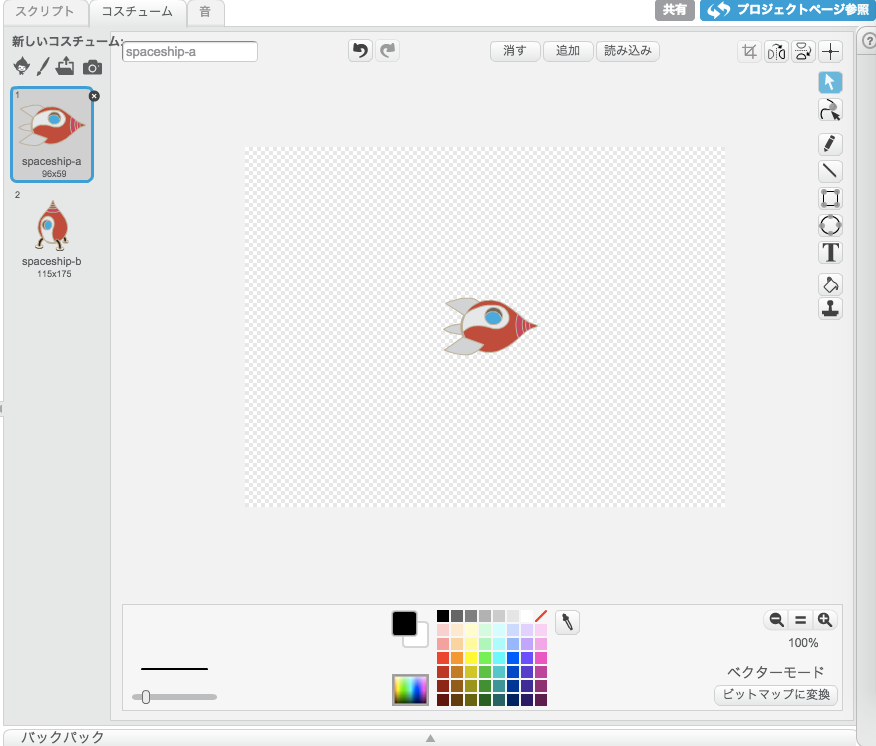

次は、ゲーム画面でスペースシップを左に置きましょう
ゲーム画面のスペースシップを左にドラックしてください！

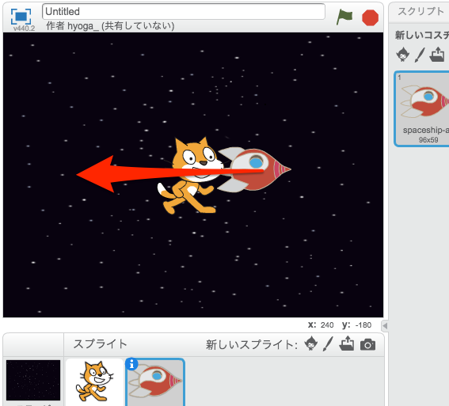

ついでに、ゲームにでてる変なねこは今回使わないので消しましょう！
下の画面で猫を右クリックして、削除をクリックしてください。

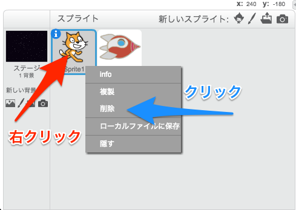

変な猫は消えましたか？
間違って新しいキャラなどを作ってしまったときは、
同じように消してください。

それでは同じように、地球とタコを下のようにおいてみてください。

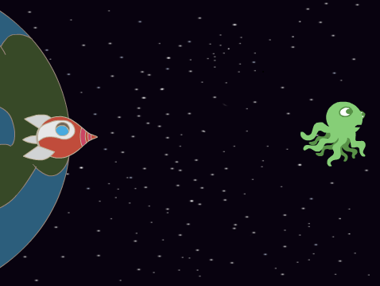

できましたか？
次はキャラクターの動きをつけます
そのための準備にスプライトのスペースシップとタコに、
下の画像と同じようにしましょう。

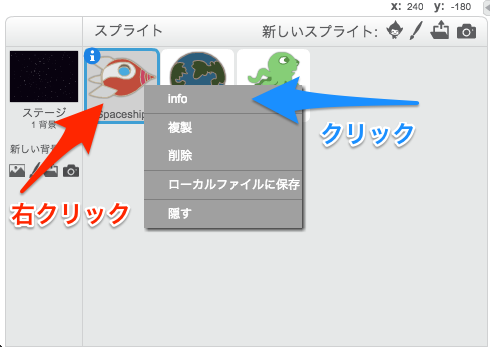

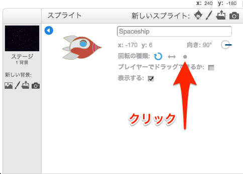

タコにも同じことをしてください。

